# FlashCard-App-React
This application allows users to study given decks and create their own decks for study. The application also allows users to create their own cards and also edit or delete any others.

## Technology

- This was built using Bootstrap, React.js, Javscript, HTML5, and CSS3

## Screenshots 

### Home Page

- Shows a list of current decks

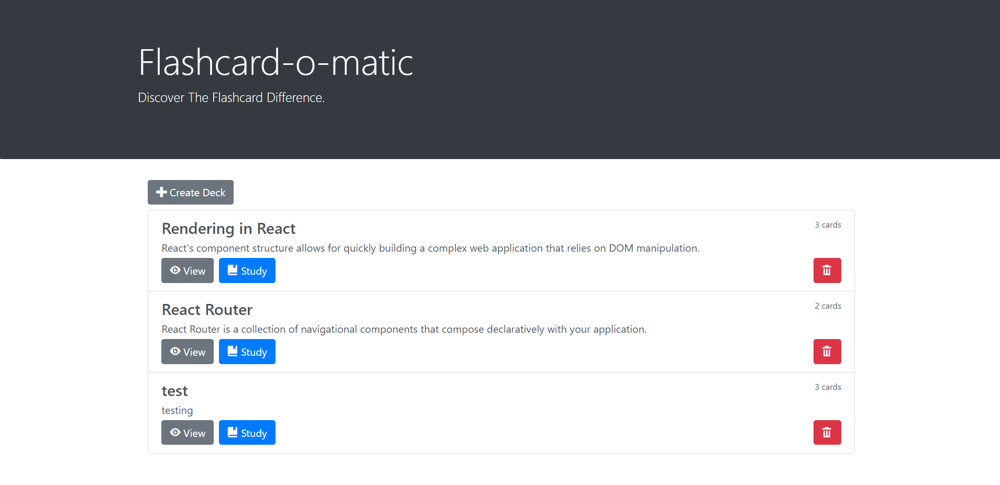

### Create Deck

- Opens page where you can create new deck

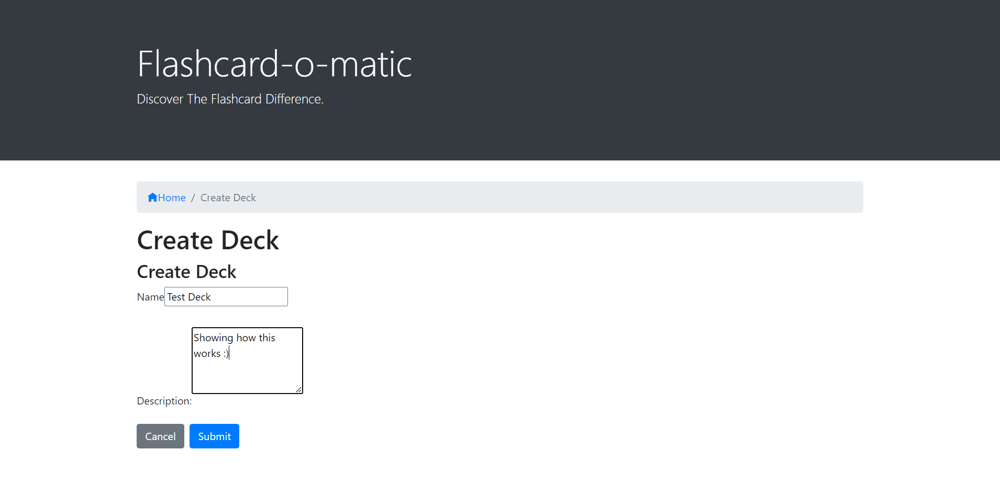

- Once the deck is created

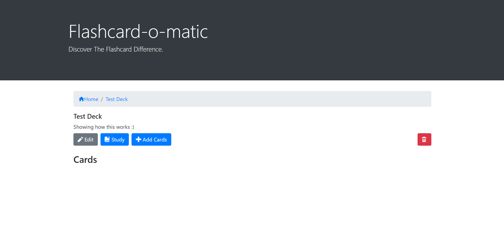

### Add Cards to New Deck

- Create both front and back of new cards

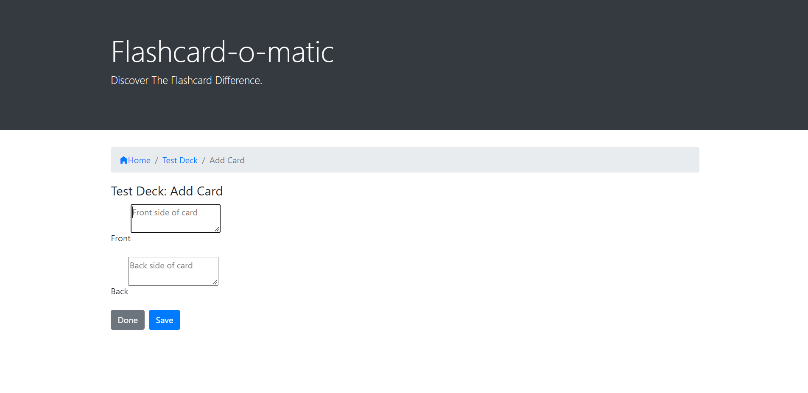

- Cards now saved to deck

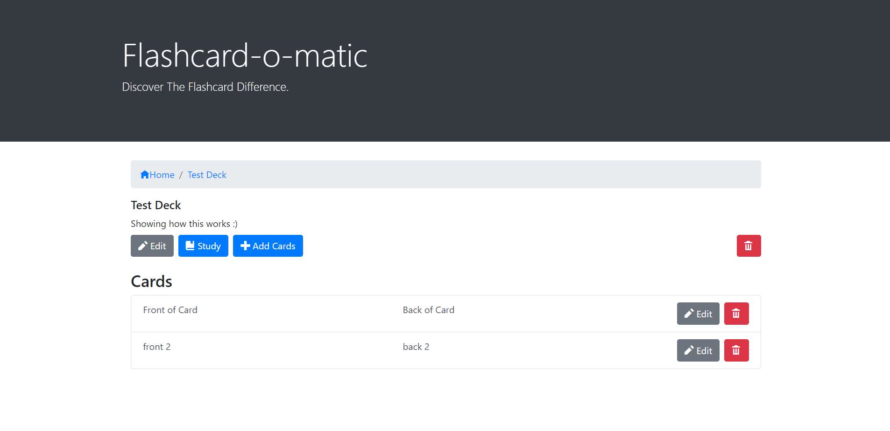

### Delete 

- Delete deck with warning

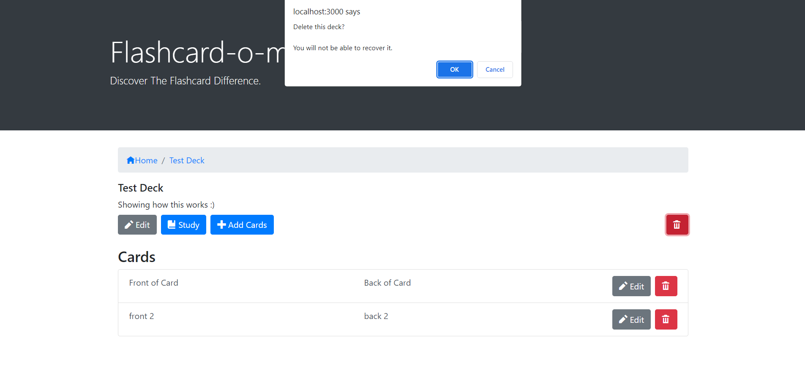

- Delete cards with warning

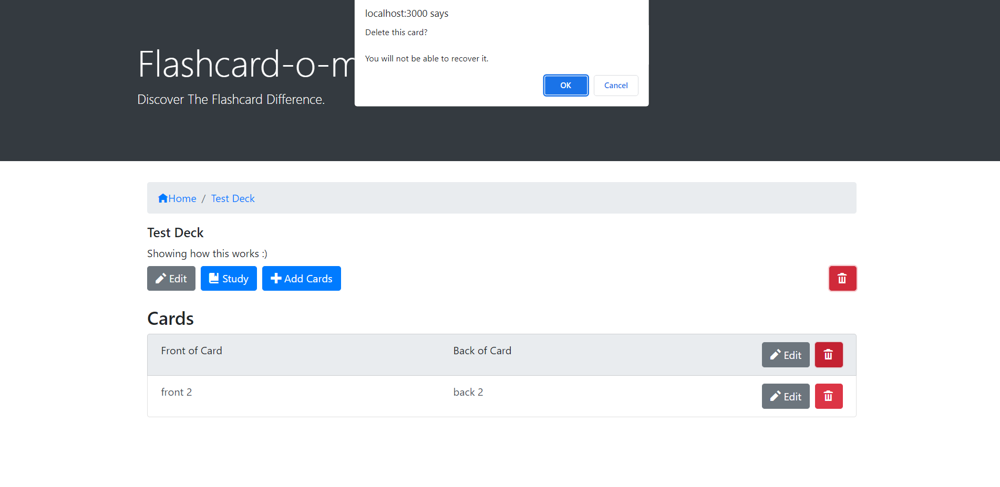

### Study

- If you try to study now you will get a warning.

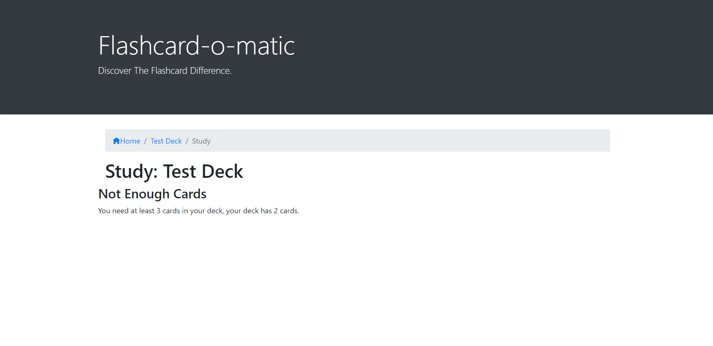

- But after adding one more card you can now study the new deck

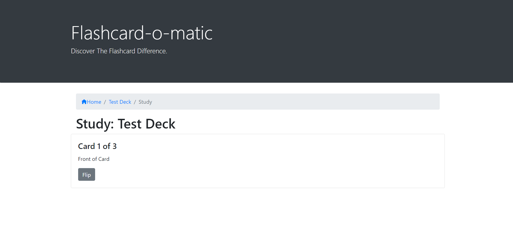

- And flip to the back of the cards

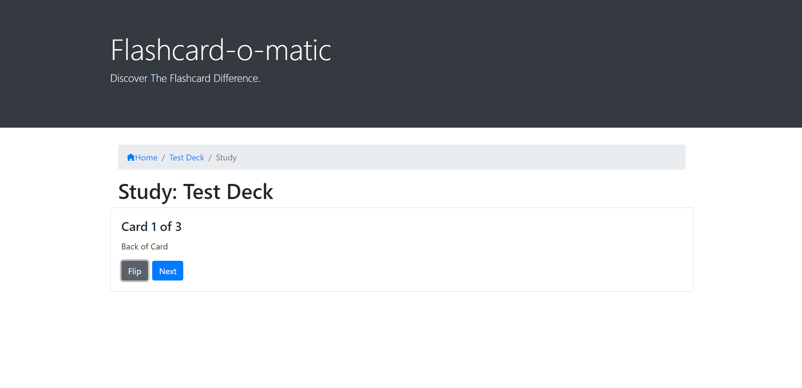

- Finally once you're done you can study again or return home

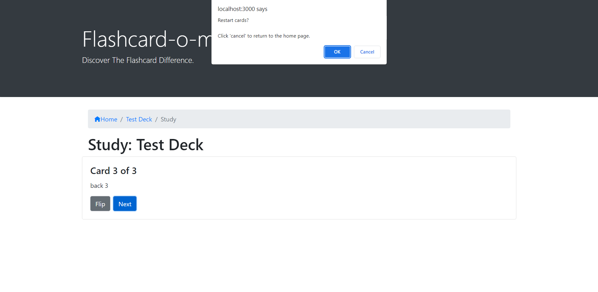

